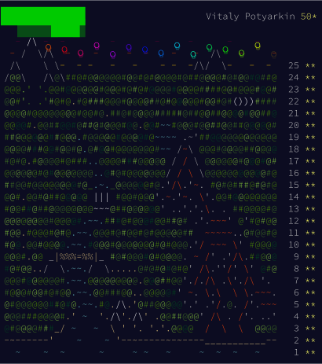

# Advent of Code 2022

This is the first time I'm participating in [Advent of Code](https://adventofcode.com)

I'm using Go. I've started writing in this language very recently (one month
before AoC). Solving these puzzles helped me to develop some intuition and
muscle memory to become a better Gopher :)

## All puzzles for AoC 2022 are done!

<!--
HOWTO: SVG screenshot of a web page
- Print to PDF
- Open PDF in Inkscape
- Edit and save to SVG
-->

## Usage

If you stumble upon this repo and decide to run any of my solutions,
use `Makefile` from current directory.

- Execute latest solution in this repo: `make solve`
- Execute solution for a specific day: `make solve DAY=4`, also: `make day04`, `make day4`
- Execute all solutions: `make all`
- Show answers for my input file: `make answer`, `make answers`, `make answer DAY=4`
- Print description of Makefile targets: `make help`
